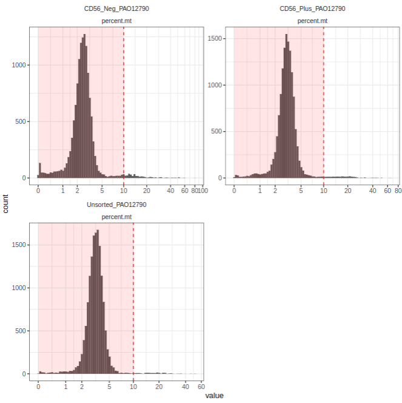
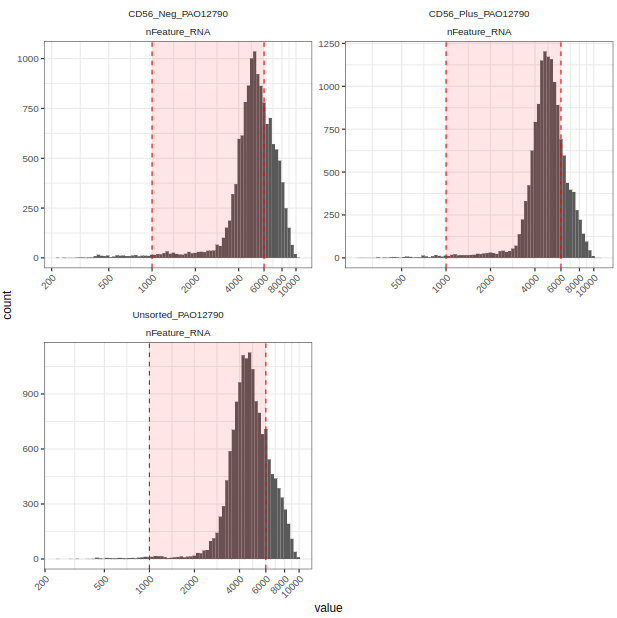
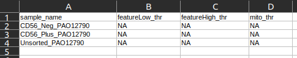

# scRNASeq_COSR_Standard_Workflow

This is the standard scRNASeq workflow at the Center of Genomics Sciences @OSR: [COSR](https://research.hsr.it/en/centers/omics-sciences.html).
This streamlined process enables comprehensive analysis of single-cell data, from raw sequences to insightful biological interpretations.

The workflow begins by processing raw scRNA-Seq fastq.gz files typically generated from Illumina sequencers and 10x Chromium 3' libraries. Cell x gene matrices, generated by [Cellranger](https://www.10xgenomics.com/support/software/cell-ranger/latest) v8.0 starting from the fastq files serve as the foundation for further analysis.

A series of quality control (QC) filters and checks is applied to each sample to evaluate data integrity. 
After individual sample analysis, the samples are first merged to assess for the prence of potential batch effects and then integrated. Integration is performed using Seurat's v5.1.0 anchoring procedure to minimize batch effects and highlight meaningful biological differences. The merged and integrated datasets are then characterzied to produce: unbiased clustering across all samples, UMAP visualizations and Cluster-specific marker identification.


The workflow has been developed using modules of snakemake files developed by the scRNASeq team at [COSR](https://research.hsr.it/en/centers/omics-sciences.html).

## Version updates

Tools must be updated once a year by the sys-admin following scFG internal discussion.

## Requirements

### Number of replicates

- At least 2 for each condition

### Metadata requirements

- Tissue
- Conditions
- Principal Investigator (PI)
- Species
- Target cells per sample
- Target coverage per cell
- Sorted (Yes/No)
- Include introns (mandatory for snRNASeq, optional for scRNASeq) [Task assigned to EP]
- Expected cell types
- Transgene presence
- Protocol of extraction
- Vitality data from the wet lab
- Issue: clogging (nuclei vs cell)
- Project genes and control genes

## Setup
### 1. pypette processing
This step allows for the generation of valid samplesheet. Follow the recommended processing

### 2. run cellranger
Activate an environment with Snakemake v8
```
conda activate snakemake
```

#### custom reference
In case you want to add an additional transgene to your reference.
Prepare the transgene.fasta file. Modify accordingly the "trans" config fields and then run:
```
snakemake --sdm conda -p cellranger_mkref_default
```

#### singlerun
In case you want to keep separated runs independent, use the following command:
```
snakemake --sdm conda -p cellranger_singlerun_default
```
The pipeline will generate the following results:
```
$ tree -L 4 results/
results/
|-- cellranger
|   |
|   `-- single
|       |-- 240606_A00626_0808_BHVWFWDMXY
|       |   |-- CD56_Neg_PAO12790
|       |   |-- CD56_Neg_PAO12790_finished.log
|       |   |-- CD56_Plus_PAO12790
|       |   |-- CD56_Plus_PAO12790_finished.log
|       |   |-- Unsorted_PAO12790
|       |   `-- Unsorted_PAO12790_finished.log
|       `-- 240712_A00626_0830_BHH73NDSXC_1
|           |-- CD56_Neg_PAO12790
|           |-- CD56_Neg_PAO12790_finished.log
|           |-- CD56_Plus_PAO12790
|           |-- CD56_Plus_PAO12790_finished.log
|           |-- Unsorted_PAO12790
|           `-- Unsorted_PAO12790_finished.log
|-- multiQC
|   |
|   `-- single
|       |-- multiqc_data
|       `-- multiqc_report.html
`-- web_summaries
    |
    `-- single
        |-- 240606_A00626_0808_BHVWFWDMXY
        |   |-- CD56_Neg_PAO12790_web_summary.html
        |   |-- CD56_Plus_PAO12790_web_summary.html
        |   `-- Unsorted_PAO12790_web_summary.html
        `-- 240712_A00626_0830_BHH73NDSXC_1
            |-- CD56_Neg_PAO12790_web_summary.html
            |-- CD56_Plus_PAO12790_web_summary.html
            `-- Unsorted_PAO12790_web_summary.html
```


#### multirun
In case you want to merge separated runs, use the following
```
snakemake --sdm conda -p cellranger_multirun_default
```
The pipeline will generate the following results:
```
$ tree -L 3 results/
results/
|-- cellranger
|   |
    `-- merged
|       |-- CD56_Neg_PAO12790
|       |-- CD56_Neg_PAO12790_finished.log
|       |-- CD56_Plus_PAO12790
|       |-- CD56_Plus_PAO12790_finished.log
|       |-- Unsorted_PAO12790
|       `-- Unsorted_PAO12790_finished.log
|-- multiQC
|   |
    `-- merged
|       |-- multiqc_data
|       `-- multiqc_report.html
`-- web_summaries
    |
    `-- merged
        |-- CD56_Neg_PAO12790_web_summary.html
        |-- CD56_Plus_PAO12790_web_summary.html
        `-- Unsorted_PAO12790_web_summary.html
```
NOTICE: `cellranger_multirun_default` can be run for any number of runs (1,2,3,..), even if samples have different number of runs.

## 3. run Seurat

### Seurat pre-processing (and cellranger if needed)

The seurat_preprocessing rule generates an individual Seurat object for each sample and calculates initial quality metrics before any filtering is applied. The primary QC metrics calculated at this stage are the number of features per cell and the percentage of mitochondrial reads.

To execute this step, run the following command:
```
snakemake --sdm conda -np seurat_preprocessing
```
**NOTICE**: This rule can be run as a standalone first step, which will also generate `cellranger` and `multiQC` outputs. Alternatively, it can be run after `cellranger_multirun_default` to exclusively produce the `results/Seurat` directory.

#### Expected Output Structure
The pipeline will generate the following directory structure:
```
$ tree -L 3 results/
results/
|-- Seurat
|   |-- object
|   |   |-- CD56_Neg_PAO12790_obj_preQC.rds
|   |   |-- CD56_Plus_PAO12790_obj_preQC.rds
|   |   `-- Unsorted_PAO12790_obj_preQC.rds
|   |-- plot
|   |   |-- fixed_histo_features_V5.pdf
|   |   `-- fixed_histo_mito_V5.pdf
|   `-- table
|       |-- CD56_Neg_PAO12790_meta_preQC.tsv
|       |-- CD56_Plus_PAO12790_meta_preQC.tsv
|       |-- LUT_QC.csv
|       |-- Unsorted_PAO12790_meta_preQC.tsv
|       `-- meta_total_beforeQC_V5.tsv
|-- cellranger
|   `-- merged
|       |-- CD56_Neg_PAO12790
|       |-- CD56_Neg_PAO12790_finished.log
|       |-- CD56_Plus_PAO12790
|       |-- CD56_Plus_PAO12790_finished.log
|       |-- Unsorted_PAO12790
|       `-- Unsorted_PAO12790_finished.log
|-- multiQC
|   `-- merged
|       |-- multiqc_data
|       `-- multiqc_report.html
`-- web_summaries
    `-- merged
        |-- CD56_Neg_PAO12790_web_summary.html
        |-- CD56_Plus_PAO12790_web_summary.html
        `-- Unsorted_PAO12790_web_summary.html

```

#### Pre-processing Workflow

The rule orchestrate two preprocessing steps:

* STEP 01 (`workflow/scripts/01_sample_preprocessing_snakemake.R`): For each sample, this script loads the filtered feature-barcode matrix and creates a Seurat object. A preliminary filter is applied to remove genes detected in fewer than 20 cells and cells with fewer than 200 genes (these values are currently hardcoded). The script then calculates the percentage of mitochondrial, ribosomal, and globin transcripts for each cell based on organism-specific gene patterns (human `9606` or mouse `10090`, specified via the `organism_id` parameter in `config/config.yaml`). 
It also implements two strategies to identify potential low-quality cells and adds their output to the metadata. **NOTICE: These flags are for informational purposes only and are not used for filtering at this stage**.

    * **Multivariate Outlier Detection**: Uses `adjOutlyingness` to identify outliers based on log-transformed counts and mitochondrial percentage. Results are stored in the `discard_multi` metadata column. Barcodes labelled as `TRUE` means outliers.
    * **Univariate Outlier Detection**: Uses `isOutlier` to identify cells with outlier values for mitochondrial percentage or feature counts independently. Results are stored in the `discard_single` metadata column. Barcodes labelled as `TRUE` means outliers.

    Finally, the complete Seurat object is saved as an `.rds` file, and its metadata is exported as a `.tsv` file.

* STEP 02 (`workflow/scripts/01_aggregate_QC_snakemake.R`): The script reads all the individual metadata tables, where each table corresponds to a specific sample. These tables are then systematically combined into a single, comprehensive data frame. To maintain the identity of each cell's origin, a dataset column containing the sample name is added during the aggregation process. Next, the script generates two multi-panel plots using ggplot2 to visualize the distributions of key QC metrics across all samples simultaneously:

    * Mitochondrial Percentage Plot: This plot consists of faceted histograms showing the distribution of the mitochondrial gene percentage (percent.mt) for each sample. The x-axis is log-transformed to better display the cell population. Just for reference, a common QC threshold (10%) is highlighted with a vertical line shaded area shows the barcodes that will be retained. 
    
    

    * Feature Count Plot: This plot consist of faceted histograms to show the distribution of the number of detected genes (nFeature_RNA) per cell. This plot also features a log-transformed x-axis and highlights, just for reference, a typical range for high-quality cells (1,000-6,000 features).
    
    

    Finally, the script creates a template look-up table (LUT, `results/Seurat/table/LUT_QC.csv`) that lists all sample names. This table includes placeholder columns for sample-specific filtering thresholds: a lower and upper bound for feature counts (featureLow_thr, featureHigh_thr) and an upper limit for mitochondrial percentage (mito_thr).



**The user should now explore the panel and fill the `LUT_QC.csv` file with the parameters to filter each individual sample (arbitraty thresholds)**.

NOTICE: Currently the `01_aggregate_QC_snakemake.R` script handle the size of the panel with the following logic (so far I have tested a rubst response up to 10 samples):

```
test <- length(sample_name)

message("number of samples processed: ", test)

panel_row <- test %>% sqrt() %>% round(digits = 0)
panel_col <- (test / panel_row) %>% ceiling()
```

The panels are then sized as follows:

```
ggsave(plot = p_mito,
       out_plot_mito,
       width = 4 * panel_col,
       height = 4 * panel_row)
```

The `results/Seurat` folder contains the three subfolders:

* `results/Seurat/object`: this folder contains the `.rds` object per sample.
* `results/Seurat/plot`: this folder contains the panel plot.
* `results/Seurat/table`: this folder contains the individula metadata per sample and the LUT for the QC metrics.

### Seurat processing
**Before proceeding with this step, make sure the `LUT_QC.csv` file has been filled**

Running the rule `seurat_analysis` will take as input each individual `.rds` preQC (produced from `seurat_preprocessing`) and the user-filled `LUT_QC.csv`.
```
snakemake --sdm conda -np seurat_analysis
```

#### Processing Workflow
The rule orchestrate the following steps:

* STEP 01: (`workflow/scripts/02_apply_QC_snakemake.R`): This script apply quality control (QC) filters to remove low-quality cells and flag doublets. The process begins by loading a pre-processed Seurat object and the user-defined Quality Control Look-Up Table (LUT). This LUT is a CSV file containing sample-specific filtering thresholds. The script identifies and retrieves the thresholds corresponding to the specific sample being processed.

    Using the loaded thresholds, a boolean metadata column named `discard_threshold` is added to the Seurat object. Cells are marked as `TRUE` for removal if their mitochondrial percentage exceeds `mito_thr` or if their feature count falls outside the range defined by `featureLow_thr` and `featureHigh_thr`.

    **Before applying this filters**, the script proceeds to identify cellular doublets—artifacts where two cells are captured in a single droplet. Following the best-practice recommendations for `scDblFinder`, a preliminary processing workflow is performed on the unfiltered data (after removing cells with fewer than 500 total counts, currently hardcoded). This workflow includes data normalization, identification of variable features, scaling, PCA, and clustering. The resulting cell clusters are then used as input for the `scDblFinder` function, which calculates a doublet score for each cell. The resulting classification `scDblFinder.class` and score `scDblFinder.score` are appended to the Seurat object's metadata.

    With the doublet information now available, the script performs the final filtering step. It subsets the Seurat object, retaining only the cells where the `discard_threshold` flag is `FALSE`. This clean, filtered dataset is then subjected to a full, standard Seurat pre-processing pipeline.
    ```
    scobj_filter <- scobj_filter %>%
        NormalizeData() %>%
        FindVariableFeatures(selection.method = "vst", nfeatures = 2000) %>%
        ScaleData() %>%
        RunPCA() %>%
        FindNeighbors(dims = 1:30) %>%
        FindClusters() %>%
        RunUMAP(dims = 1:30)
    ```

    **This ensures that all downstream analyses are based solely on the high-quality singlet population**.

    Currently the processing after QC, at individual sample uses some harcoded parameters: `nfeatures = 2000`, `vars.to.regress = NULL`,`npcs = 50`, `dims = 1:30` and `resolution = 0.8`. This due to the fact that nothing else will be done on those clusters and dimensionality reductions before integration. After integration the rule will build again a stop-and-go procedure to decide `ndims` and `resolution` to produce markers and cellular ids.

    The script concludes by saving the final, filtered, and fully re-processed Seurat object as an RDS file. Additionally, the corresponding cell metadata is exported as a separate tab-separated value (TSV) file for potential after-QC plotting (not implemented yet).


## Sections 
The scRNAseq workflow is divided into the following sections:

### 1. Collection of fastq.gz files
Fastq.gz files coming from Illumina runs after sample demultiplexing are collected through one or several runs into a single folder container using symbolic links. The information about sample name, lane, chunk, run and project is properly managed to collect only proper runs and samples. Care should be taken to comply to Cellranger (v8.0) naming standards to be analyzed. Please refer to [Cellranger](https://www.10xgenomics.com/support/software/cell-ranger/latest) web page for further details.

### 2. Quality control of sequencing
A first step of sequencing quality control is made on all files coming from the different samples after collecting them to obtain fastQC files of the sequencing.
1. [FastQC](https://www.bioinformatics.babraham.ac.uk/projects/fastqc/) v0.11.9 (latest v0.12.0): It gives us an idea of the quality of the R2 reads, containing transcripts.

2. [Cellranger](https://www.10xgenomics.com/support/software/cell-ranger/latest) count (v8.0): It is used to select barcodes that are containing live/high quality cells with a high amount of transcripts.

All these results with their QC logs and plots are collected and presented using [MultiQC](https://multiqc.info/) v1.21 (latest 1.25.1, not tested yet) plots and the html collection of data obtained by Cellranger count function.

### 3. Production of the cell x count matrix

Once the quality control steps are completed, the cell x count matrix is produced using the Cellranger (v8.0) count function. This function processes the FASTQ files for each sample, aligns the reads to the reference genome, and then counts the unique molecular identifiers (UMIs) associated with each gene for every cell.

- Mouse Genomes: mm39 with an option to switch to mm10 (MM33).

- Human Genome: Hg38 (Gencode 44)

### 4. Normalization and filtering of the count matrix

Once the raw cell x count matrix is generated, it's necessary to normalize and filter the data to remove technical biases and low-quality cells that might confound the analysis. Sample processing is performed with Seurat (v5.0.1).

### 5. Highlight doublets

[DoubletFinder](https://github.com/chris-mcginnis-ucsf/DoubletFinder) v2.0.4 is used to detect doublets in the scRNAseq data. Doublets occur when two or more cells are mistakenly captured in the same droplet during the sequencing process, leading to mixed or incorrect transcriptomic profiles for a single cell. When we run the standard pipeline we do not remove the doublets, we just highlight them.

### 6. Dimensionality reduction (UMAP) and clustering

Once the data is normalized and filtered, the next step is to reduce its dimensionality and cluster cells based on their gene expression profiles. This helps to visualize complex patterns in the data and identify distinct cell populations.

### 7. Differential abundance testing 

[miloR](https://www.bioconductor.org/packages/release/bioc/html/miloR.html) v2.0.0 is used to perform cell-type proportion analysis due to its effective handling of collinearity.

### 8. Cell-type assignment

[singleR](https://www.bioconductor.org/packages/release/bioc/html/SingleR.html) tested with v2.4.1 with Seurat 5, (last v3.19) is employed for the automatic cell-typing.

### 9. Plots

- Seurat (v5.1.0) Standard QC Violin Plots for Each Sample.
- The following key quality control metrics are visualized for each sample using violin plots in Seurat:

1) Nfeatures
2) ncounts
3) ribo
4) mito
5) hb

- UMAP on integrated and merged samples, coloured by:
1) orig.ident (merged and integrated)
2) clusters (merged and integrated)
3) condition (merged and integrated)

- FeaturePlot of integrated UMAP representing:

1) cell-cycle
2) mitocondrial gene expression
3) nFeatures
4) doublets
5) project significant genes chosen by the collaborator

- Stacked barplot of cluster proportions in each condition / orig.ident
- Heatmap of top10 all.markers 
- FeaturePlot top3 all.markers of each cluster
- DotPlot top3 markers of each cluster


### 10. Tabular outputs

- Markers (all) of clusters  (xlsx) 
- Cluster abundances (xlsx)


Other dependencies:
- [tidyverse](https://www.tidyverse.org/) (v2.0.0) 
- [ComplexHeatmap](https://bioconductor.org/packages/release/bioc/html/ComplexHeatmap.html) (v2.21.1)
- [Plotly]
- [downloadthis]
- [xfun]
- [knitr]
- [reactable](https://glin.github.io/reactable/)


### 11. Use case

A folder to test the standard pipeline was created in /beegfs/scratch/ric.cosr/ric.cosr/scRNASeq_COSR_Standard_Workflow.

Within this folder there are several subfolders:

- fastq_sample:
it contains raw data that can be used to test the pipeline.
Fastq files belong to PaninaP_2122_scRNAseq project and represent four samples coming from brain organoids, including control samples (NT) and treated samples with Short chain Fatty Acid (SCFA) at two different time points: 6 weeks (W6) and 8 weeks (W8). W6 Samples can be found in run 231130_A00626_0719_AHNN5VDMXY_1, while W8 samples can be found in run 231218_A00626_0728_AHNWWGDMXY. 

- workflow:
contains the snakefile, rules, schemas and  scripts to perform the analysis.

- report:
contains the R markdown file to produce the html report. 

- shared:
contains the COSR logo and the folder structure images.

- config:
contains the samples.csv and the config.yaml file.

- metatada:
contains metadata information for the specific project


